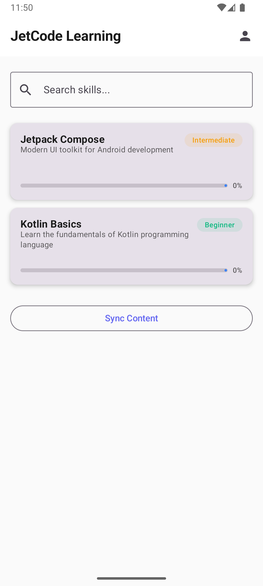
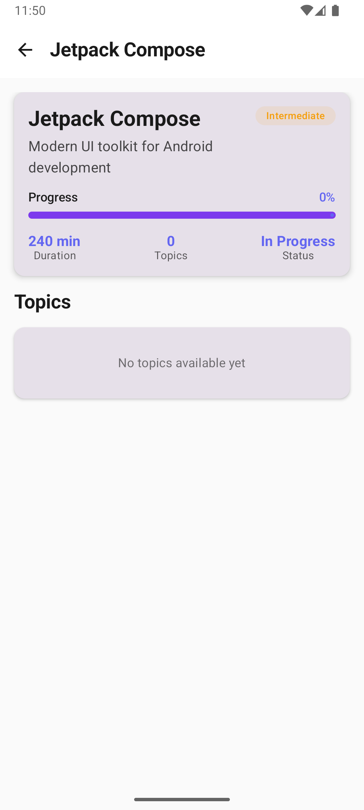
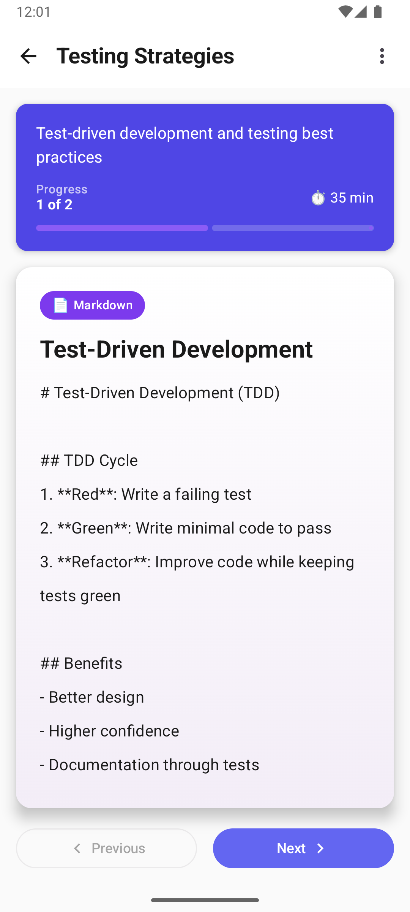
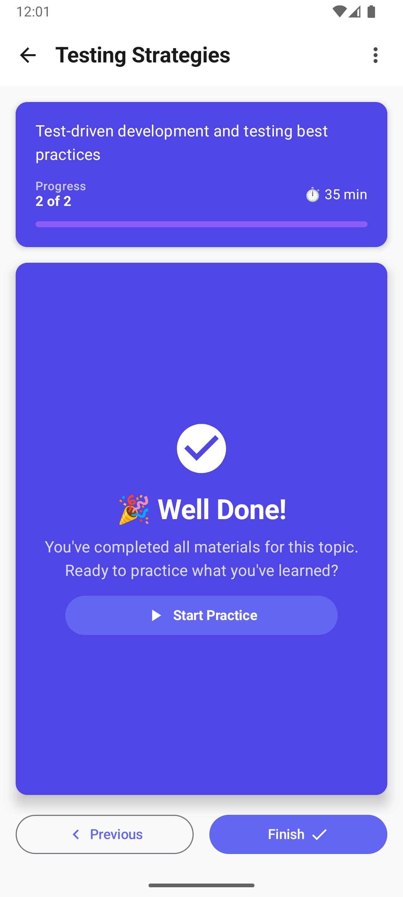
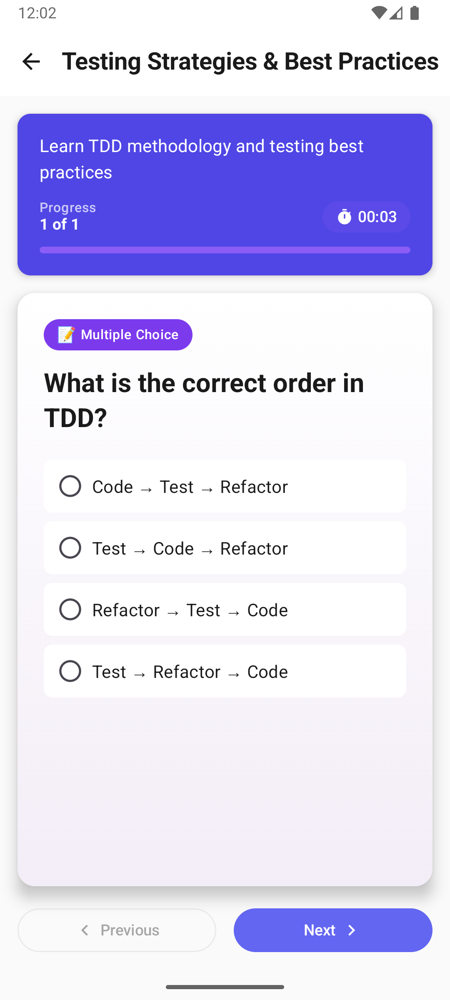
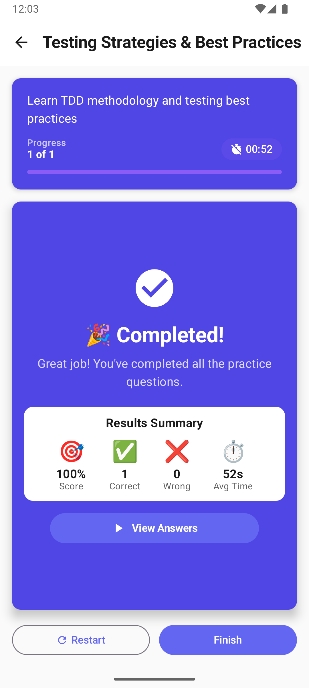
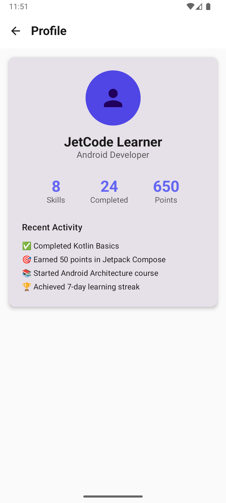

# 📱 JetCode - Interactive Kotlin & Android Learning Platform
[](https://opensource.org/licenses/MIT)
[](https://android-arsenal.com/api?level=24)
3. Commit your changes (`git commit -m 'Add amazing feature'`)

An **Interactive Learning Mobile Application** for mastering **Kotlin** and **Android Development** through curated flashcard-style content, comprehensive quizzes, and progress tracking. Built with modern Android development practices using **Clean Architecture**, **MVI pattern**, and **Jetpack Compose**.

### 🧪 Quality Standards

- Run `./gradlew ktlintCheck` for formatting
|------------|------------------|---------------|----------------|
|  |  |  |  |

| Practice Quiz | Quiz Results | Statistics | Profile & Settings |
|---------------|--------------|------------|-------------------|
|  |  |  |  |

## ✨ Core Features

### 🎯 Interactive Learning System
- **JetBrains** for Kotlin language and tooling
- **Open Source Community** for amazing libraries and inspiration
- **Diverse Material Types**: 
  - 📝 **TEXT**: Summarized knowledge in flashcard format
  - 📄 **MARKDOWN**: Formatted technical documentation
  - 💻 **CODE**: Interactive Kotlin/Android code examples
  - 🖼️ **IMAGE**: Visual diagrams and illustrations
  - 🎥 **VIDEO**: Tutorial and demonstration content
- **Curated Content**: Focus on Kotlin and Android application development

### 🧠 Comprehensive Practice System
⭐ **Star this repository if it helped you learn Kotlin & Android!**
  - 📊 **MCQ**: Multiple Choice Questions
Built with ❤️ for the Android development community
  - ✏️ **FILL_BLANK**: Code completion challenges
- **Difficulty-Based Practice**: Adaptive difficulty levels
- **Timed Quizzes**: Built-in timer for skill assessment
- **Detailed Results**: Complete answers with explanations
- **Standalone Practice Bundles**: Independent quiz collections

### 📊 Progress Tracking & Analytics
- **Skill Progress**: Visual progress indicators for each skill
- **Topic Completion**: Track materials completed per topic
- **Learning Statistics**: Comprehensive learning analytics
- **Quiz Performance**: Detailed quiz activity and results history
- **Achievement System**: Progress milestones and achievements

### 🎨 Modern User Experience
- **Material Design 3**: Latest design system implementation
- **Dynamic Theming**: Multiple color schemes with system preference
- **Dark/Light Mode**: Seamless theme switching
- **Responsive Design**: Optimized for various screen sizes
- **Smooth Navigation**: Intuitive app flow and transitions

## 🏗️ Content Architecture

### 📚 Learning Hierarchy
```
🎯 Skills (Kotlin & Android Development)
├── 📖 Topics (Specific areas like "Coroutines", "Compose UI")
│   ├── 📄 Materials (Text, Code, Video, Images)
│   └── 🧩 Practice Bundle (Topic-specific quizzes)
└── 📊 Progress Tracking (Completion percentage)
```

### 🧩 Quiz System
```
🎮 Practice Bundles
├── 📝 MCQ Questions
├── 💻 Code Challenges  
├── 🔮 Output Prediction
├── ✏️ Fill in the Blanks
├── ⏱️ Timer System
└── 📊 Results & Explanations
```

## 🛠️ Technical Implementation

### 🏗️ Architecture Overview
```
┌─────────────────────────────────────────────────────────────┐
│                     Presentation Layer                     │
│  ┌─────────────────┐ ┌─────────────────┐ ┌─────────────────┐ │
│  │   📱 Compose UI  │ │  🎯 ViewModels  │ │ 🧭 Navigation  │ │
│  └─────────────────┘ └─────────────────┘ └─────────────────┘ │
└─────────────────────────────────────────────────────────────┘
                               │
┌─────────────────────────────────────────────────────────────┐
│                      Domain Layer                          │
│  ┌─────────────────┐ ┌─────────────────┐ ┌─────────────────┐ │
│  │   🔄 Use Cases  │ │   🏛️ Repository │ │   📋 Models    │ │
│  └─────────────────┘ └─────────────────┘ └─────────────────┘ │
└─────────────────────────────────────────────────────────────┘
                               │
┌─────────────────────────────────────────────────────────────┐
│                       Data Layer                           │
│  ┌─────────────────┐ ┌─────────────────┐ ┌─────────────────┐ │
│  │  🌐 Remote API  │ │  💾 Local DB    │ │ 🔧 Data Sources│ │
│  └─────────────────┘ └─────────────────┘ └─────────────────┘ │
└─────────────────────────────────────────────────────────────┘
```

### 🧩 Modular Structure
```
📦 JetCode/
├── 📱 app/                          # Main application module
├── 🎯 features/                     # Feature modules
│   ├── learning/                    # Skills, Topics, Materials
│   ├── onboarding/                  # User onboarding flow
│   ├── practice/                    # Quiz and practice system
│   └── profile/                     # User profile & statistics
├── 🏗️ core/                        # Core shared modules
│   ├── analytics/                   # Learning analytics
│   ├── common/                      # Shared utilities
│   ├── designsystem/                # Material Design 3 theming
│   ├── network/                     # API communication
│   └── ui/                          # Shared UI components
├── 💾 data/                         # Data layer modules
│   ├── database/                    # Local caching (Room)
│   └── repository/                  # Data management
└── 🏛️ domain/                       # Business logic & models
```

### 📋 Domain Models
```kotlin
// Core content hierarchy
Skill → Topic → Material
     → PracticeSet → Quiz

// Material types: TEXT, MARKDOWN, CODE, IMAGE, VIDEO
// Quiz types: MCQ, CODE_CHALLENGE, OUTPUT_PREDICTION, FILL_BLANK
// Difficulty levels: Beginner, Intermediate, Advanced
```

## 🔧 Technologies & Libraries

### 🏗️ Architecture & Pattern
- **🏛️ Clean Architecture**: Clear separation of concerns
- **🔄 MVI Pattern**: Unidirectional data flow
- **🧩 Multi-module**: Scalable architecture
- **💉 Koin**: Dependency injection

### 🎨 UI & Design
- **🎨 Jetpack Compose**: Modern declarative UI
- **🧭 Navigation Compose**: Type-safe navigation
- **🎨 Material Design 3**: Latest design system
- **🌙 Dynamic Theming**: Color schemes & dark/light mode
- **🖼️ Coil**: Efficient image loading

### 💾 Data & Storage
- **🏠 Room Database**: Local data persistence
- **💾 DataStore**: User preferences management
- **🌐 Ktor Client**: HTTP client for content loading
- **📄 Kotlinx Serialization**: Type-safe JSON handling

### ⚡ Async & Background
- **🔄 Kotlin Coroutines**: Asynchronous programming
- **🔄 Kotlin Flow**: Reactive data streams
- **⚙️ WorkManager**: Background content sync

### 🧪 Testing & Quality
- **🧪 JUnit 4**: Unit testing framework
- **🎭 MockK**: Kotlin mocking library
- **🧪 Compose Testing**: UI testing
- **🔍 Detekt**: Static code analysis
- **🎨 Ktlint**: Code formatting

## 🚀 Getting Started

### Prerequisites
- **Android Studio**: Flamingo or newer
- **JDK**: 11 or higher
- **Android SDK**: API 24+ (Android 7.0)
- **Gradle**: 8.11.0

### 🛠️ Installation

1. **Clone the repository**
   ```bash
   git clone https://github.com/yourusername/jetcode.git
   cd jetcode
   ```

2. **Open in Android Studio**
   - Launch Android Studio
   - Select "Open an existing project"
   - Navigate to the cloned directory

3. **Sync and build**
   ```bash
   ./gradlew build
   ```

4. **Run the application**
   - Select your device/emulator
   - Click "Run" or use `Ctrl+R` (Windows/Linux) / `Cmd+R` (Mac)

### 🔧 Build Commands
```bash
# Debug build
./gradlew assembleDebug

# Release build
./gradlew assembleRelease

# Run tests
./gradlew test

# Code quality checks
./gradlew detekt ktlintCheck
```

## 🎯 App Flow & Navigation

### 📱 User Journey
1. **Onboarding**: Introduction to the learning platform
2. **Skills Dashboard**: Browse available Kotlin/Android skills
3. **Skill Details**: View topics within selected skill
4. **Topic Learning**: Study materials (text, code, videos)
5. **Practice Quiz**: Test knowledge with various quiz types
6. **Results & Progress**: Review performance and track progress
7. **Profile**: View statistics and customize settings

### 🧭 Navigation Structure
```
Onboarding → Skills List → Skill Detail → Topic Detail → Practice
                ↓              ↓             ↓           ↓
            Profile ←──────────────────────────────── Results
```

## 📊 Key Dependencies

| Category | Library | Version | Purpose |
|----------|---------|---------|---------|
| **Kotlin** | Kotlin | 2.0.21 | Programming language |
| **Build** | AGP | 8.11.0 | Android Gradle Plugin |
| **UI** | Compose BOM | 2024.09.00 | UI toolkit |
| **Navigation** | Navigation Compose | 2.8.0 | App navigation |
| **DI** | Koin | 3.5.6 | Dependency injection |
| **Network** | Ktor | 2.3.12 | HTTP client |
| **Database** | Room | 2.6.1 | Local storage |
| **Testing** | MockK | 1.13.12 | Testing framework |

## 🤝 Contributing

We welcome contributions! Please follow these steps:

### 📋 Development Workflow
1. Fork the repository
2. Create a feature branch (`git checkout -b feature/amazing-feature`)
3. Commit your changes (`git commit -m 'Add some amazing feature'`)
4. Push to the branch (`git push origin feature/amazing-feature`)
5. Open a Pull Request

### 🧪 Code Quality
- Run `./gradlew detekt` for static analysis
- Run `./gradlew ktlintCheck` for code formatting
- Ensure all tests pass with `./gradlew test`
- Follow [Kotlin coding conventions](https://kotlinlang.org/docs/coding-conventions.html)

## 📄 License

This project is licensed under the MIT License - see the [LICENSE](LICENSE) file for details.

## 🙏 Acknowledgments

- **Google** for Android and Jetpack libraries
- **JetBrains** for Kotlin and amazing tooling
- **Open Source Community** for incredible libraries and inspiration

## 📞 Support

- 📚 [Documentation](docs/)
- 🐛 [Report Issues](https://github.com/yourusername/jetcode/issues)
- 💬 [Discussions](https://github.com/yourusername/jetcode/discussions)

---

⭐ **Star this repository if it helped you!**

Built with ❤️ for the Android community
