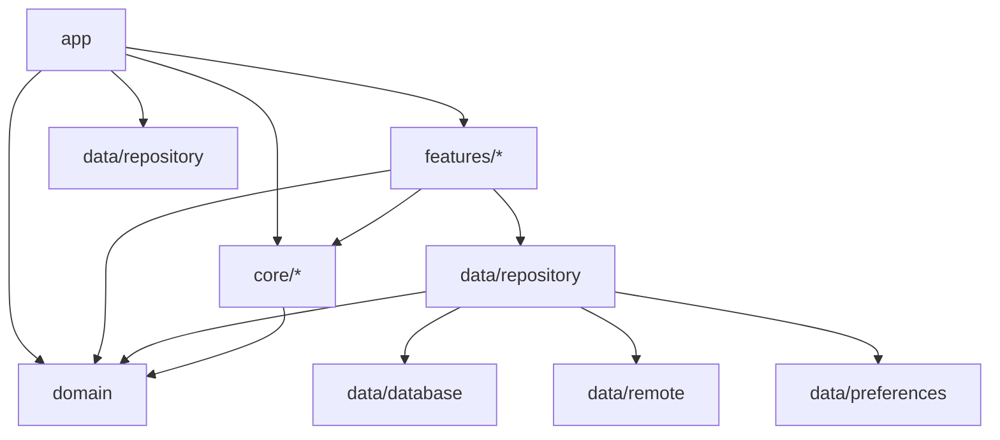

# JetCode Project Architecture

## Overview

JetCode is an Android application for coding education and practice built using modern Android development practices. The project follows **Clean Architecture** principles with a multi-module structure, implementing **MVI (Model-View-Intent)** pattern for UI state management and **MVVM** for presentation layer architecture.

## Project Structure

```
JetCode/
├── app/                    # Main application module
├── core/                   # Core shared modules
│   ├── analytics/          # Analytics and tracking
│   ├── common/            # Common utilities and base classes
│   ├── designsystem/      # Design system and theming
│   └── ui/                # Reusable UI components
├── data/                   # Data layer modules
│   ├── database/          # Local database (Room)
│   ├── preferences/       # User preferences (DataStore)
│   ├── remote/            # Network layer (Ktor)
│   └── repository/        # Repository implementations
├── domain/                 # Business logic and use cases
└── features/              # Feature-specific modules
    ├── learning/          # Learning content features
    ├── onboarding/        # User onboarding
    ├── practice/          # Practice and quizzes
    └── profile/           # User profile
```

## Technology Stack

### Core Technologies:
- **Kotlin**: Primary language
- **Jetpack Compose**: Modern declarative UI
- **Coroutines + Flow**: Asynchronous programming
- **Koin**: Dependency injection
- **Room**: Local database
- **Ktor**: HTTP client
- **DataStore**: Preferences storage

### Architecture Components:
- **Navigation Compose**: Type-safe navigation
- **ViewModel**: UI state management
- **StateFlow/SharedFlow**: Reactive state
- **WorkManager**: Background tasks (future sync improvements)

## Module Dependencies



## Architecture Layers

### 1. Domain Layer (`domain/`)
**Pure Kotlin module** containing business logic, independent of Android framework.

#### Components:
- **Models**: Core business entities (`Skill`, `Topic`, `Material`, `Quiz`, `PracticeSet`)
- **Repository Interfaces**: Abstract contracts for data access
- **Use Cases**: Single-responsibility business operations
- **Common Types**: `Result<T>` wrapper, error handling

#### Key Patterns:
```kotlin
// Domain models inherit from abstract Content class for polymorphism
abstract class Content

data class Skill(...) : Content()
data class Topic(...) : Content()
data class Material(...) : Content()
```

#### Use Case Pattern:
```kotlin
class GetSkillsUseCase(
    private val learningRepository: LearningRepository,
    private val dispatcherProvider: DispatcherProvider
) {
    operator fun invoke(): Flow<Result<List<Skill>>>
}
```

### 2. Data Layer (`data/`)
Implements domain repository interfaces and manages data sources.

#### Modules:
- **`database/`**: Room database with DAOs and entities
- **`remote/`**: Ktor HTTP client and API services
- **`preferences/`**: DataStore for user preferences
- **`repository/`**: Repository pattern implementations

#### Repository Pattern:
```kotlin
// Repository implementation handles both local and remote data
class LearningRepositoryImpl(
    private val learningDao: LearningDao,
    private val apiService: LearningApiService,
) : LearningRepository {
    // Implements offline-first strategy
    // Maps between entities and domain models
}
```

#### Data Mapping Strategy:
- **Entities** ↔ **Domain Models** via extension functions
- Separate concerns: database entities vs business models
- Type-safe serialization with kotlinx.serialization

### 3. Presentation Layer (`features/`)
Feature-based modularization with MVI pattern.

#### MVI Architecture:
```kotlin
// Base MVI ViewModel
abstract class BaseViewModel<State : UiState, Intent : UiIntent, Effect : UiEffect>(
    initialState: State
) : ViewModel() {
    // Unidirectional data flow
    // State management with StateFlow
    // Side effects with Channel
}
```

#### Feature Structure:
```
features/learning/
├── data/           # Feature-specific data (if any)
├── domain/         # Feature-specific use cases
└── presentation/   # UI layer
    ├── skill_list/     # Screen-specific packages
    │   ├── SkillListScreen.kt
    │   ├── SkillListViewModel.kt
    │   └── SkillListContract.kt
    └── skill_detail/
```

### 4. Core Layer (`core/`)
Shared utilities and foundational components.

#### Modules:
- **`common/`**: Base classes, utilities, Result wrapper, MVI interfaces
- **`designsystem/`**: Theme, colors, typography, component styles
- **`ui/`**: Reusable Compose components
- **`analytics/`**: Event tracking and analytics

## Data Flow Architecture

### Offline-First Strategy:
1. **UI Layer** requests data via **Use Cases**
2. **Repository** checks **Local Database** first
3. If data is stale/missing, fetch from **Remote API**
4. **Sync Manager** handles background synchronization
5. **Database** serves as single source of truth

### State Management Flow:
```
User Intent → ViewModel → Use Case → Repository → Database/API
                ↓
UI State ← ViewModel ← Result<T> ← Repository ← Data Source
```

## Key Design Patterns

### 1. MVI (Model-View-Intent)
```kotlin
// Contract definition
interface SkillListContract {
    data class State(...) : UiState
    sealed class Intent : UiIntent
    sealed class Effect : UiEffect
}

// ViewModel implementation
class SkillListViewModel : BaseViewModel<State, Intent, Effect>() {
    override fun handleIntent(intent: Intent) {
        // Process user intents
    }
}
```

### 2. Repository Pattern
- **Interface Segregation**: Separate repository interfaces for different domains
- **Offline-First**: Local database as single source of truth
- **Data Synchronization**: Background sync with remote APIs

### 3. Use Case Pattern
- **Single Responsibility**: Each use case handles one business operation
- **Dependency Injection**: Use cases receive dependencies via constructor
- **Coroutines Integration**: Async operations with proper error handling

### 4. Dependency Injection (Koin)
```kotlin
val repositoryModule = module {
    single<LearningRepository> {
        LearningRepositoryImpl(
            learningDao = get(),
            apiService = get(),
        )
    }
}
```

## Naming Conventions

### Packages:
- `com.appsbase.jetcode.{layer}.{module}.{feature}`
- Example: `com.appsbase.jetcode.feature.learning.presentation.skill_list`

### Classes:
- **ViewModels**: `{Feature}ViewModel` (e.g., `SkillListViewModel`)
- **Use Cases**: `{Action}{Entity}UseCase` (e.g., `GetSkillsUseCase`)
- **Repositories**: `{Domain}Repository{Impl}` (e.g., `LearningRepositoryImpl`)
- **Entities**: `{Entity}Entity` (e.g., `SkillEntity`)
- **Screens**: `{Feature}Screen` (e.g., `SkillListScreen`)

### Files:
- **Contracts**: `{Feature}Contract.kt` for MVI state/intent/effect definitions
- **Mappers**: `{Domain}Mappers.kt` for entity ↔ model conversions
- **Modules**: `{Feature}Module.kt` for Koin DI modules

## Error Handling Strategy

### Result Wrapper:
```kotlin
sealed class Result<out T> {
    data class Success<T>(val data: T) : Result<T>()
    data class Error(val exception: Throwable) : Result<Nothing>()
    data object Loading : Result<Nothing>()
}
```

### Error Types:
```kotlin
sealed class AppError : Exception() {
    sealed class NetworkError : AppError()
    sealed class DataError : AppError()
    // Specific error types with user-friendly messages
}
```

## Navigation Architecture

### Centralized Navigation:
- **Single NavHost** in `JetCodeNavHost`
- **Type-safe arguments** using Navigation Compose
- **Destination constants** in `JetCodeDestinations`
- **Deep linking support** for external navigation

### Navigation Pattern:
```kotlin
// Screen-to-screen navigation via callbacks
SkillListScreen(
    onSkillClick = { skillId ->
        navController.navigate("skill_detail/$skillId")
    }
)
```

## Testing Strategy

### Module-Level Testing:
- **Unit Tests**: Use cases, repositories, mappers
- **Integration Tests**: Database operations, API calls
- **UI Tests**: Screen interactions, navigation flows

### Testing Tools:
- **JUnit 4**: Unit testing framework
- **MockK**: Mocking library
- **Coroutines Test**: Testing coroutines and flows
- **Room Testing**: Database testing utilities

## Code Quality Standards

### Static Analysis:
- **Detekt**: Kotlin code analysis
- **KtLint**: Code formatting
- **Custom rules**: Architecture compliance

### Code Organization:
- **Feature-based modules**: Logical separation
- **Clean Architecture layers**: Clear boundaries
- **Dependency direction**: Always toward domain
- **Single Responsibility**: One concern per class

## Development Guidelines

### When Adding New Features:
1. **Start with Domain**: Define models, repository interface, use cases
2. **Implement Data Layer**: Entities, DAOs, API service, repository impl
3. **Create Presentation Layer**: Screen, ViewModel, Contract
4. **Add DI Configuration**: Update relevant Koin modules
5. **Update Navigation**: Add routes and navigation logic

### When Modifying Existing Features:
1. **Check Dependencies**: Ensure changes don't break dependent modules
2. **Update Tests**: Maintain test coverage for changes
3. **Follow Patterns**: Use existing patterns and conventions
4. **Error Handling**: Maintain consistent error handling strategy

### Code Review Checklist:
- [ ] Follows Clean Architecture principles
- [ ] Uses proper MVI pattern implementation
- [ ] Includes appropriate error handling
- [ ] Maintains offline-first data strategy
- [ ] Follows naming conventions
- [ ] Includes unit tests for business logic
- [ ] Updates documentation if needed

## Future Architecture Considerations

### Scalability:
- **Multi-user support**: User-specific data isolation
- **Content versioning**: Handle content updates gracefully
- **Performance optimization**: Lazy loading, pagination
- **Caching strategy**: Implement sophisticated cache policies

### Modularity:
- **Dynamic features**: Modularize features for on-demand delivery
- **Shared libraries**: Extract common functionality
- **Plugin architecture**: Support for third-party integrations

This architecture document serves as the foundation for maintaining consistency and quality in the JetCode project. All development should align with these principles and patterns.
